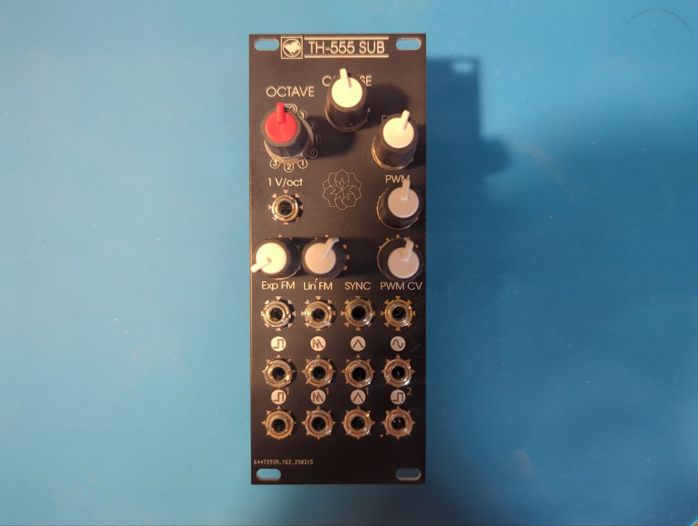

# TH555 SUB VCO

This is a remake of eurorack module for the excellent and fully-analog Thomas Henry 555 VCO [[1](https://electro-music.com/forum/topic-54623.html)] [[2](https://github.com/gerb-ster/TH-555-VCO)] [[3](https://www.eddybergman.com/2020/12/synthesizer-build-part-37-thomas-henry.html)].
I added some features and tweaks to the module (inventing very little...) to make it more appealing to be built in 2025.

1. Added a sub-octave stage chained with the module to generate a square, sawtooth and triangle waves 1 octave below, and a square wave 2 octaves below; this is basically taken from [[4](https://electro-music.com/wiki/pmwiki.php?n=Schematics.WaveThingMultiply-DivideWaveShapingCircuit)] 
2. Added an octave switch using a rotatory switch widely available in the DIY eurorack stores (the same of MTM turing machine [[5](https://www.musicthing.co.uk/Turing-Machine/)]
3. Drastically reduced the range of coarse/fine knobs to be used in combination with the octave switch (COARSE = +/- 2 octaves; FINE = +/- 3 semitones)
4. Added a LFO function, with larger range for the COARSE/FINE knobs, and a configurable basic frequence.
5. Switched input/output to thonkiconn
6. Removed the manually matched pair of transistors in favor of the in-chip matched BCM857BS
7. All components are now SMT (easy hand soldered SOIC, 0603 passives)

## Versions
# 0.1
First take, this version had several errors, both schematic copying errors and in the sub-octabve section. This version was used to develop v 0.2 but sources are lost.

# 0.2
Almost completely working version. 

Improvements wrt vs 0.1
- ✅ The clock feed circuit for the sub-octave is completely redesigned
- ✅ Several minor copying errors have been corrected
- ✅ The panel for octave switch has been corrected
- ✅ Resistors for the octave switch are now marked in the correct order
- ✅ All the trimmer are now in the same format (3214X) + name added for each
Problems:
- ❌ Transistors footprint is incorrect (they shuld be mounted upside-down)
- ❌ The frontpanel interface is not optimal
- ❌ Octave switch is not properly tuned depending on the fluctuation of resistors
- ❌ Calibration is not easy

Also this version was lost.

# 0.3
This version is the current one, waiting to be built, it was designed starting from reverse-eng of v0.2 from production files. 

Improvements wrt vs 0.2
- ✅ Front panel redesign 
- ✅ Added leds to visualize the wave
- ✅ Corrected footprint of transistors
- ✅ Added a trimmer for octave-switch calibration

